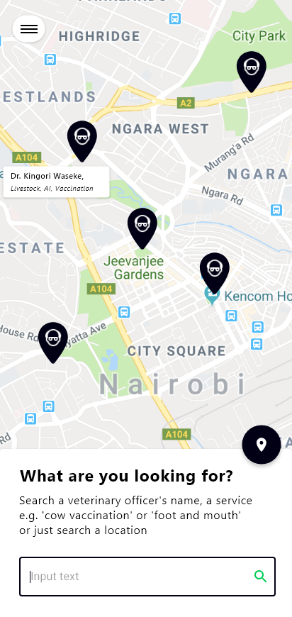
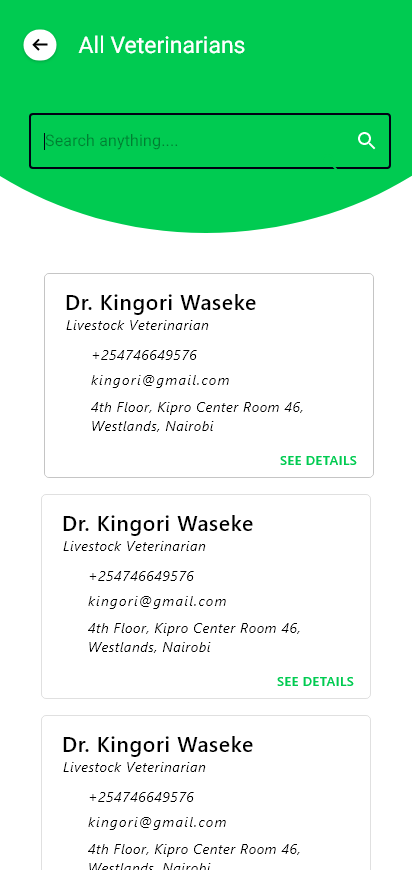
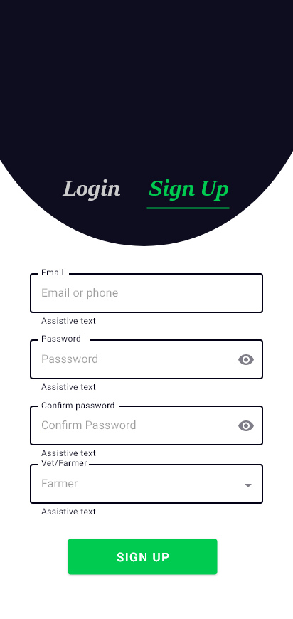
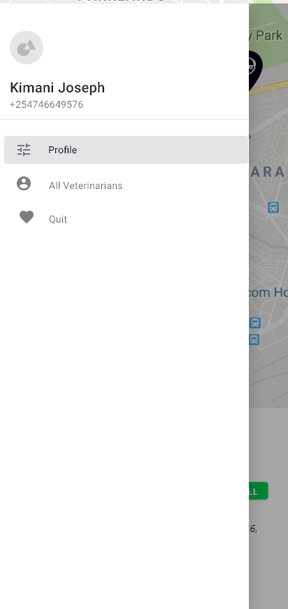
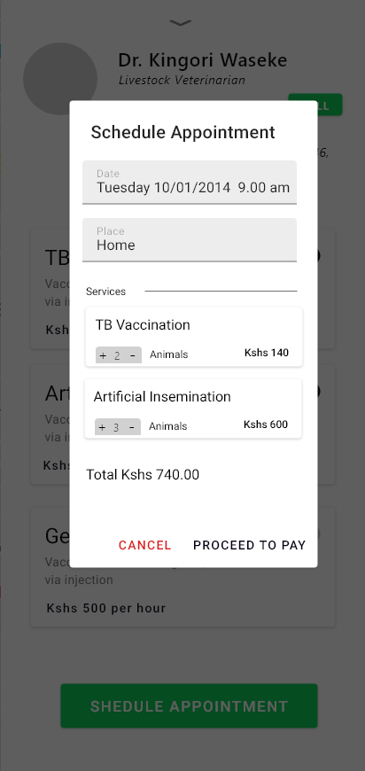
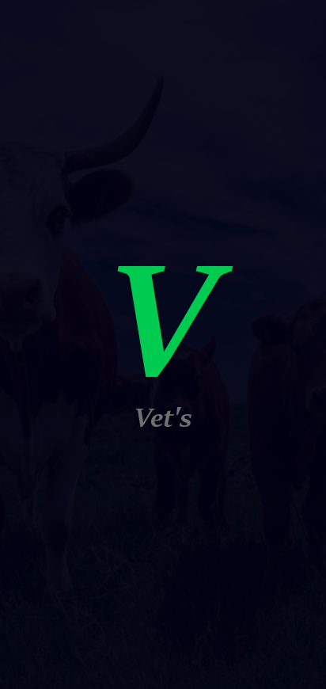
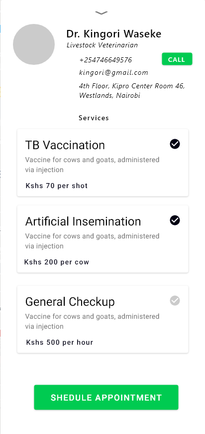
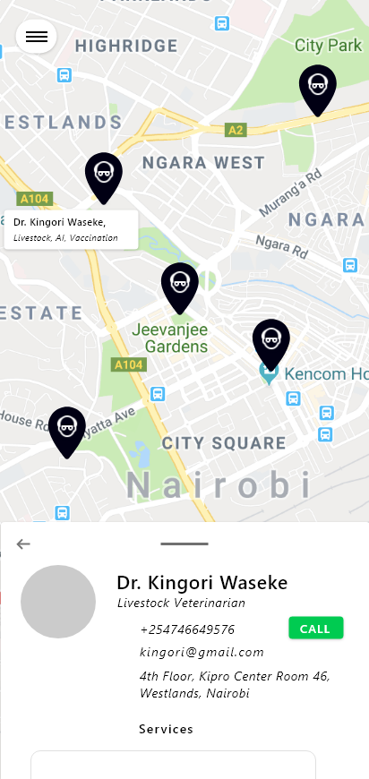

[](https://codemagic.io/apps/6063709f2812d7ad277dca6c/6063709f2812d7ad277dca6b/latest_build)

> :warning: **Work in progress**

# Vets

Vets is a concept flutter app that allows farmers to search for veterinary officers in their area, checkout their services and schedule appointments .This flutter app fetches data from a grpc backend ([https://github.com/ndirangug/vet-backend](https://github.com/ndirangug/vet-backend)). 


## Screenshots
- Home
   
- All vets
    
- Login
    
- NavDrawer
  
- Schedule Dialog
    
- Splash
    
- Vet Details Full
    
- Vet Summary
  

## Install APK
A CI pipeline has been setup with [CodeMagic](https://codemagic.io/). A built apk is available at this url [https://api.codemagic.io/artifacts/19c460a7-b162-43bc-80e8-37194a958914/faaf6d91-0baa-467d-bae9-299994928257/app-release.apk](https://api.codemagic.io/artifacts/19c460a7-b162-43bc-80e8-37194a958914/faaf6d91-0baa-467d-bae9-299994928257/app-release.apk)

## Test Locally
### Prerequistes
- Flutter SDK

```bash
$ make run
```


